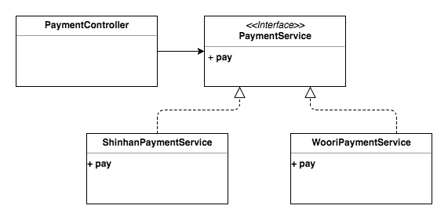
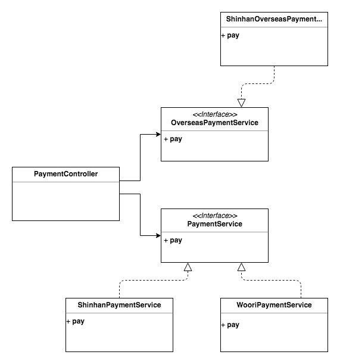

## 객체지향 프로그래밍

흔히 있는 정의. 

```
객체지향 프로그래밍이란 캡슐화, 다형성, 상속을 이용하여 코드 재사용을 증가시키고,
유지보수를 감소시키는 장점을 얻기 위해서
객체들을 연결 시켜 프로그래밍 하는 것 것입니다.
```

<br>

위에 있는 정의를 다시 설명하면 **클래스(Class or Object)**가 이러한 성질을 띄고 있다. 

* 캡슐화(Encapsulation)
* 다형성(Polymorphism)
* 상속(Inheritance)

위 항목을 지킨 **프로그래밍 기법**이 `객체지향 프로그래밍` 이다. 

<br>

*지금까지 말한 항목은 잊어도 좋습니다. 다시 시작할게요.* 

------------------------------

### 객체지향 프로그래밍

보통 인터넷 서칭을 하면 많은 인터넷 글들이 위와 같이 **구현**에 치우쳐진 글들이 많습니다. 

근데, 구현 방법은 어디까지나 편리하게 사용하기 위한 방법이지 그게 `근본`은 아닙니다. 

<br>

그렇다면.. 객체지향 프로그래밍에서. 

**객체**라는게 뭘까요?  

```text
단순히 상속, 다형성, 캡슐화, 합성 등 객체지향 구현기법이 핵심이 아니라
1. 역할(Role)
2. 책임(Responsibility)
3. 협력(Collaboration)
이 적절하게 잘 구현된 것이 객체이다. 
- 오브젝트, 조영호
```

역할, 책임, 협력은 뭐고 도대체 어떻게 객체를 판단하는 것일까요?  

조금 더 보충 설명으로 `오브젝트` 책에 있는 내용의 정의를 인용하자면,  

```text
협력: 객체들이 애플리케이션의 기능을 구현하기 위해 수행하는 상호작용
책임: 객체가 협력에 참여하기 위해 수행하는 로직
역할: 객체들이 협력 안에서 수행하는 책임들이 모여 객체가 수행하는 역할
```

**협력**이라는 것은. 

어떤 객체(Object)가 다른 객체(Object)에게 무언가를 요청하는 것. 

```java
class Barista {
  public makeCoffee(Order order) {
    return new Coffee(...);
  }
}
```

위와 같이 어떤 객체(Object) 안에서 협력들이 모이고 모여서 만들어지는 것이 **책임**   

많은 객체들(Objects) 속에서 특정 객체(Object)가 맡게 되는 것이 **역할**. 

<br>

그래서 설계를 진행할 때,  

`역할` 의 관점으로는 **숲**을 볼 수 있고,  

`책임` 의 관점으로는 **나무**를 볼 수 있고,  

`협력`의 관점으로는 **나뭇가지**를 볼 수 있다.  

*조금은 이해가 되셨을라나요.?ㅎㅎ*. 

<br>

그러면.. 위에 3개 항목중에서 제일 중요한게 뭐라고 생각하나요.?

<br>

<div>
  
</div>

저는 **책임** 이라고 생각합니다. 

책임이 제일 중요한 이유는  

* 기능 추가(feature)를 할 때
* 리팩토링(Refactoring)을 할 때
* 뜯어고칠(ㅠㅠ) 때

이 **객체를 그대로 놓아도 괜찮을 것인가?** 에 대한 척도를 마련해주기 때문입니다. 

<div>
  
</div>

PayService가 있고, 원래 국내 결제만 하다가 해외 결제가 추가되는 정책이 생긴다고 가정합시다. 

위와 같이 설계하고 그대로 두는 것이 올바를까요.?  

만약 국민 카드가 국내 결재만 허용 하게 된다면.? 설계가 무너집니다. 

따라서 PayService의 책임을 `분리` 하는게 올바르다고 생각합니다. 

<div>
  
</div>


결국.!  

객체지향에서의 핵심은.. 어떤 **필드(data)**를 가지고 있는 것이 아니라. 

어떤 **동작(method)**을 실행할 것이 중요하다. 

지금까지 OOP를 **역할**, **책임**, **협력**이라는 3가지 관점에서 바라보았는데요..  

어떻게 하면 쉽게 연습할 수 있을까요?  

### 객체지향 생활 체조

[소트웍스 앤솔러지](http://www.yes24.com/Product/Goods/3290339) 에 따르면 객체지향을 훈련하기 위한 **9가지 방침**이 안내되어 있습니다. 

* 규칙 1: 한 메서드에 오직 한 단계의 들여쓰기만 한다
* 규칙 2: else 예약어를 쓰지 않는다
* 규칙 3: 모든 원시값과 문자열을 포함한다
* 규칙 4: 한 줄에 점을 하나만 찍는다
* 규칙 5: 줄여쓰지 않는다(축약 금지)
* 규칙 6: 모든 엔티티를 작게 유지한다
* 규칙 7: 2개 이상의 인스턴스 변수를 가진 클래스를 쓰지 않는다
* 규칙 8: 일급 콜렉션을 쓴다 
* 규칙 9: Getter/Setter Property를 쓰지 않는다

경우에 따라서는 조금 너무 엄격(?)하다고 생각하지만, **최대한 할 수 있는 선**에서 도전해보는 것이 중요한 것 같습니다. 

달리기 연습할 때, 모래주머니를 차고 연습하면 당시에는 힘들지만 결과적으로 도움이 되니깐요. 

그러면 하나씩 천천히 파보도록 해볼까요?  


### 규칙1: 한 메서드에 오직 한 단계의 들여쓰기만 한다

보통의 개발툴(IDE)에는 `Extract Method` 기능이 제공되어 있습니다. 

```java
class Board {
  String board() {
    StringBuffer buf = new StringBuffer();
    for (int i = 0; i < 10; i++) {
      for (int j = 0; j < 10; j++)
        buf.append(data[i][j]);
      buf.append("\n");
    }
    return buf.toString();
  }
}

class Board {
  String board() {
    StringBuffer buf = new StringBuffer();
    collectRows(buf);
    return buf.toString();
  }
  
  void collectRows(StringBuffer buf) {
    for (int i = 0; i < 10; i++)
      collectRow(buf, i);
  }
  
  void collectRow(StringBuffer buf, int row) {
    for (int i = 0; i < 10; i++)
      buf.append(data[row][i]);
    buf.append("\n");
  }
}
```

이렇게 활용하는 이유는, 아무 이유 없이 흐르는 for문 로직보다는. 

다른사람이 더 이해하기도 쉽고, collectRow 메서드를 추후에 재사용할 수 있는 가능성을 남겨두고 있기 때문입니다. 

또한, 버그 발생 위치도 알기 쉽겠죠.! **row 파라미터**를 로그로 남기면 되기 때문입니다. 

그래서 이 원칙 같은 경우에는 `Clean Code` 와 `객체지향` 이 합쳐진 원칙이 되는 것 같네요. 


### 규칙 2: else 예약어를 쓰지 않는다

한 가지 메서드에 한가지 일을 제대로 구현하는 것이 핵심인데,  

`else` 예약어는 최소 2가지 이상의 일을 하게 됩니다. 

```java
public int calculate(String operator, int number1, int number2) {
  if ("+".equals(operator)) {
    return number1 + number2;
  } else if ("-".equals(operator)) {
    return number1 - number2;
  } else if ("*".equals(operator)) {
    return number1 * number2;
  } else if ("/".equals(operator)) {
    if (number2 == 0) {
      throw new ArithmeticException();
    }
    return number1 / number2;
  }
  
  throw new IllegalArgumentException();
}
```

정말 복잡하죠.?  

위 코드는 문제가 많습니다.  

*만일, 제곱(^) 연산이 추가된다면?*  

*만일, 루트 연산이 추가된다면?*  

<br>

`calculate 메서드` 는 **기능 추가** 될 때마다 로직을 추가해야되고, 소스 코드는 끝없이 길어질 것 같네요. 

조금 더 좋은 설계가 있다면 간단하게 나타낼 수 있을 것 같습니다. 

더 다양한 방법이 있겠지만, 해결책의 예시로 하나를 제공해볼까 합니다. 

```java
enum Calculator {
  PLUS("+", Integer::sum),
  MINUS("-", (a, b) -> a - b),
  MULTIPLY("*", (a, b) -> a * b),
  DIVISION("/", (a, b) -> a / b);
  // Enum 클래스에 기능추가만 하면 됨
  
  private String operator;
  private BinaryOperator<Integer> binaryOperator;
  
  Calculator(final String operator, final BinaryOperator<Integer> binaryOperator) {
    this.operator = operator;
    this.binaryOperator = binaryOperator;
  }
  
  public static int calculate(String operator, int number1, int number2) {
    return Stream.of(values())
      .filter(calculator -> calculator.equals(operator))
      .findFirst()
      .orElseThrow(IllegalArgumentException::new)
      .binaryOperator.apply(number1, number2);
  }
  
  public int calculate(String operator, int number1, int number2) {
    return Calculator.calculate(operator, number1, number2); // 로직 진행 메서드에 관계없이
  }
}
```


### 규칙3: 모든 원시열과 문자열을 포장한다

예시를 하나 들어보자면요.. 로또를 **도메인**으로 해볼까요.?  

```java
class LottoTicket {
  private List<Integer> numbers;
}
```

보다는. 

```java
class Lotto {
  private int number;
}
class LottoTicket {
  private List<Lotto> lottoNumbers;
}
```

이렇게 하면 장점이 뭘까요.?  

* 로또 숫자에 대한 예외처리를 Lotto 객체 안에서 처리할 수 있다. 로또 숫자는 1 ~ 45 까지
* LottoTicket의 **기능확장성** 고려, LottoTicket은 더 이상 로또 숫자에 얽매이지 않고 로직 처리 가능

작은 객체가 `책임` 을 가지게 됨으로써 어떤 `역할` 을 수행할 것인지, 어떤 `협력` 을 가지고 있는지 표현 가능해집니다. 

사소하게라도 의미를 부여함으로 인해서 다른사람이 읽기 편하고 유지보수가 쉬운 코드를 만들 수 있습니다. 


### 규칙4: 한 줄에 점 하나만 찍는다 = 디미터 법칙

정말 규칙 말 그대로입니다

```java
obejctA.getObjectB().getObjectC().doSomething(); // 객체의 상태를 조회하지말고
objectA.doSomethingToC(); // 메세지를 보내라
```

.(점)을 계속 찍어서 조회하다보면 객체의 의존관계가 복잡해질 수록. 

정말 .(점)으로만 IDE  한 줄을 초과하는 현상이 나타날 수도 있을 것 같아요. 

이러한 객체일수록 **중개자**가 많다는 단점이 있는데요. 

**중개자**가 많아질 수록 유지보수가 더 힘들어집니다. 

Why? 그와 연관된 모든 중개자를 다 바꿔야 되기 때문이에요. 

가능하면 줄어보는 방안으로 **리팩토링** 시도를 해보는 것은 어떨까요?


### 규칙5: 줄여쓰지 않는다(축약 금지)

왜 우리는 습관적으로 축약하고 있는 걸까요?  

내포해야 될 내용이 길어서 축약하게 되는데. 

**메서드에 대한 책임**이 너무 과하거나 **클래스의 책임**이 더 많은 것은 아닐까요?  

최대한 `간결`하고 `문맥`이 중복되지 않는 선에서 `무엇을 하는지 알 수 있는` 네이밍을 지어보는 노력을 해봅시다.!  

```java
lotto.matchLottoNumber(otherLotto); // 보다는
lotto.match(otherLotto); // 요렇게
```


### 규칙6: 모든 엔티티를 작게 유지한다

이 말은 **50줄이 이상이 되는 클래스**와 파일이 **10개 이상인 패키지**는 없어야 한다는 뜻입니다. 

조금 가혹한(?) 느낌이 많이 들긴 하죠.?  

여기서 말한 50줄을 꼭 지키라는 것이 아니라 한 가지의 `클래스`가 한 가지 `책임`을 지니고 있냐고 물어보는 것입니다. 

이와 같은 이론으로는. 

* SRP(Single Responsibility Principle) 이 있으니 한번 참고해보세요~!

또한, 참고자료로 패키지의 경우에는 다음과 같은 구분 원칙이 있어요

* REP(The Release Reuse Equivalency Principle): 재사용 릴리즈 등가 원칙
* CCP(The Common Cloosure Principle): 같은 패키지 안의 클래스들은 동일한 종류의 변화에는 모두 폐쇄적이어야 한다
  * SRP의 패키지 버젼이라고 생각하시면 될 것 같아요
* CRP(The Common Reuse Principle): 패키지 안의 클래스는 함께 재사용되어야 한다
  * 연관된 클래스들끼리 묶어서 **패키지**를 만들자
  * ISP의 패키지 버젼이라고 생각하시면 될 것 같아요

너무 길어질까봐 [관련 링크](https://jusths.tistory.com/149) 남겨드릴게요


### 규칙7: 2개 이상의 인스턴스 변수를 가진 클래스를 쓰지 않는다

이 규칙도 너무 가혹한(?) 규칙중에 하나 인데요. 

**가능한 인스턴스 변수를 줄여보자**가 핵심이에요. 

클래스의 `응집도` 를 높여보자는 말이에요  

```text
응집도란?
: 프로그램의 한 요소가 해당 기능을 수행하기 위해
  얼마만큼의 연관된 책임과 아이디어가 뭉쳐있는지 나타내는 정도
```


```java
class MovieTheator {
  private List<String> movies;
  private List<Integer> prices;
  private List<String> reservations;
} // 단순 데이터 보다는
```

```java
class MovieTheator {
  private List<Movie> movieInformation;
  private List<Reservation> audience;
}

class Reservation {
  private String Booker;
  private Movie reservatedMovie;
}

class Movie {
  private String name;
  private int price;
}
```


### 규칙8: 일급 콜렉션을 쓴다

이 규칙은 간단합니다. 

`Collection` 을 포함한 클래스는 반드시 다른 멤버 변수가 없어야 합니다. 

```java
class Bus {
  private List<String> passenger;
  private int fuel;
} // 보다는
```

```java
class Bus {
  private Passengers passengers;
  private int fuel;
}

class Passengers {
  private List<String> person;
}
```

이 설계의 핵심은 **나만의 자료구조** 를 만드는 것에 있습니다!  

또한 List를 getter로 받게되면, List의 **Reference** 를 리턴하기 때문에 이를 안전하게 지키는 역할도 있고요.!  

(Collections.unmodifiableList(this.person) 으로 리턴). 

그리고 객체에 알맞은 메세지(메서드) 네이밍을 지어줄 수 있게 됩니다!  

의미가 없는 `List<String>` 보다는 `Passengers` 로 **책임** 과 **역할** 을 부여하는 거죠. 


### 규칙9: Getter/Setter 속성을 사용하지 않는다

절대 사용하지 말자가 아니라 최대한 지양하자 입니다. 

`Setter` 는 특히나요...  

```java
@Getter
@Setter
class Movie {
  private int name;
  private int price;
}
```

```java
class Movie {
  public int name;
  public int price;
}
```

위와 같이 나타낸 클래스는 사실상 같은 거나 다름없습니다.  

**접근제한자** 의 의미가 사라지게 되는 거죠. 

`Getter` 는 아까 말씀 드렸다시피 어쩔 수 없으면 사용해도 좋습니다. 

다만, **디미터 법칙** 이 지켜지는 선에서 사용하면 좋을 것 같아요. 

<br>

지금까지 작성한 규칙들은..

```
모든 규칙을 반드시 적용하자가 아니라
최대한 노력해보자 라는 취지에서 작성한 글입니다.
```


### 고찰

그렇다면 모든 코드에 대해 `객체지향` 을 도입할 필요가 있나.?  

*절대 그렇지 않다* 

**절차지향** 적인 코드는 디버깅이 편하고, 설계가 쉽습니다. 

반면 **객체지향** 적인 코드는 디버깅이 힘들고, 설계가 어렵습니다. 

우리는 `마감시간` 이라는 것이 존재하기 때문에, 항상 선택해야 됩니다. 

일반적으로 **Validation** 하는 로직에는 객체지향이 필요없겠죠.?  

매순간 최선의 선택을 하는 프로그래머가 됩시다. 


### 참고링크

* [비관적인 관점: 객체-지향 프로그래밍이란 무엇인가?(OOP)](https://vandbt.tistory.com/10)
* [오브젝트 - 책](http://www.yes24.com/Product/Goods/74219491)
* [객체지향 생활체조 총정리](https://developerfarm.wordpress.com/2012/02/03/object_calisthenics_summary)
* [Clean Architecture](https://jusths.tistory.com/149)
* [결합도와 응집도](https://lazineer.tistory.com/93)
* [Spring 예제로 보는 SOLID SRP](https://cheese10yun.github.io/spring-solid-srp)